# Megapixel Groups Creative Hub
Data Centric Development Milestone Project @ Code Institute

This project is a creative hub where creatives and employers meet.
The web application is built using flask and pymongo. 
It allows you to perform CRUD operations for users, creatives, briefs and skills. 
It has a form for logging in user and a form for contacting the creative/employer. 
The application provides contact information and a link to Megapixels marketing services.
You can find the application [here](https://creative-hub.herokuapp.com/).

## UX
The application is designed using the [materialize](https://materializecss.com/) framework.
It is designed to be user friendly, simple and clean with the purpose to present all information in a visually appealing manner on all devices.
It is made for creatives/employers who wants to connect with one another. 
They want to be able to create a user, creative ads and briefs. 
They want to edit user, creative ad and brief details.
They want to be able to find creative ads and briefs.
They want to be able to delete creative ads and briefs.
To provide that information this application is a simple and straightforward web application.
It contains an index page, user interface, sections for creative ads/briefs as well as for performing CRUD operations, contact etc.
The footer provides contact information and a link to Megapixels marketing services.

### User Stories
The user stories are showing pictures from an earlier stage of the project and not the deployed version. 
You can access the deployed project [here](https://creative-hub.herokuapp.com/) to try the user stories yourself.

#### Story 1
As a user, I want to click on a navigation link - 
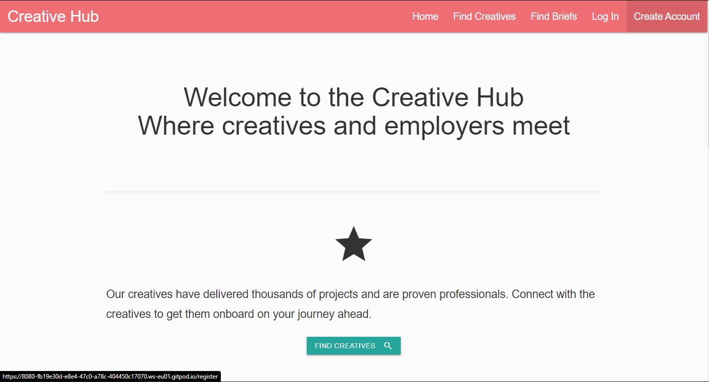 

So that I can get navigated towards the desired link location.
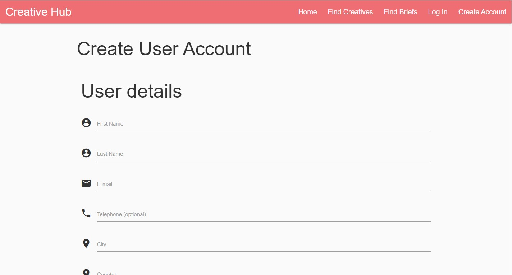 

#### Story 2
As a user, I want to create a user account -
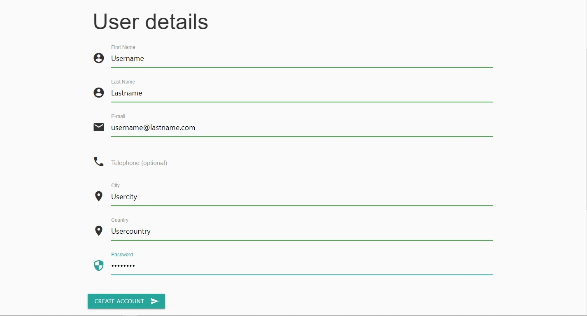 

So that I can log in to my user interface
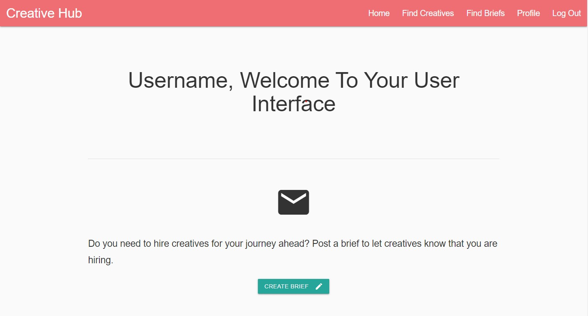

#### Story 3
As a user, I want to be able to log out -
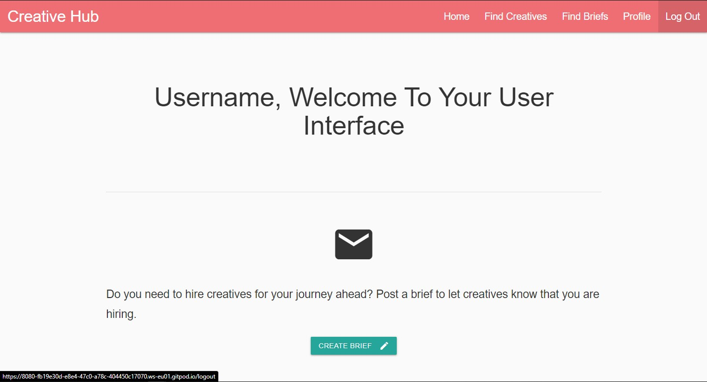

And I want to be able to log in. 
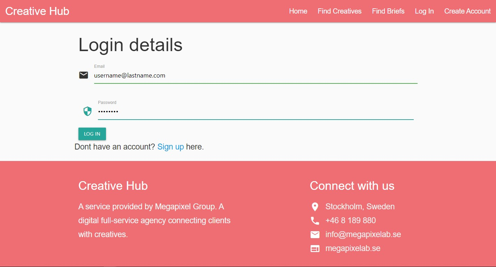

#### Story 4
As a user, I want to be able to create a brief - 
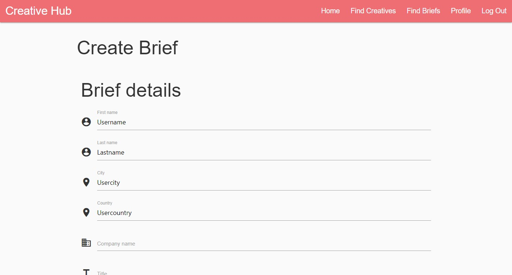 

And a creative ad.
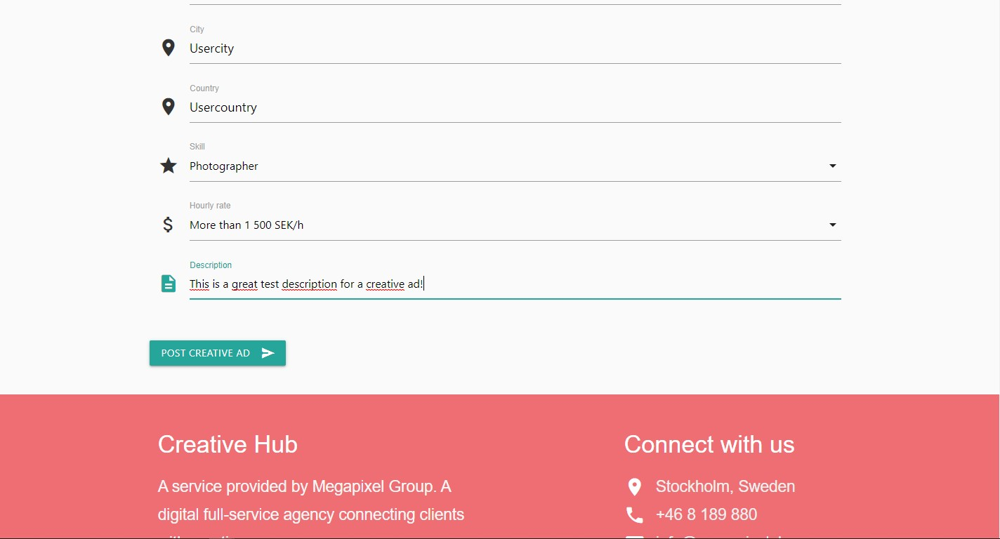

#### Story 5
As a user, I want to be able to delete a brief/creative ad -
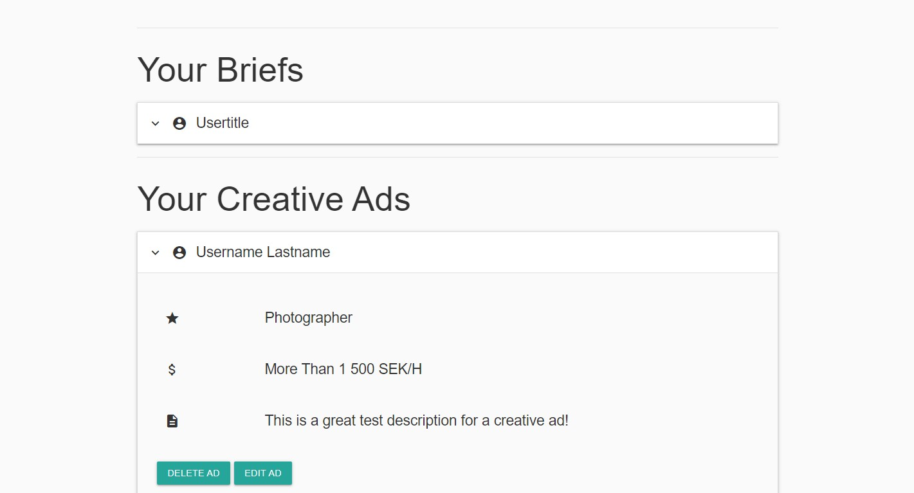

And edit/update a brief/creative ad. 

#### Story 6
As a user, I want to be able to find briefs/creative ads -
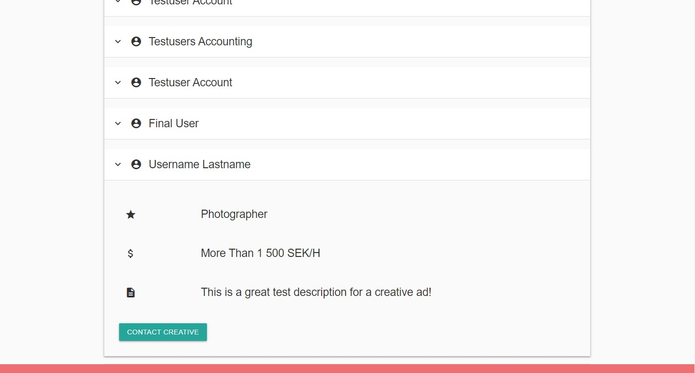

And contact the creative/employer.
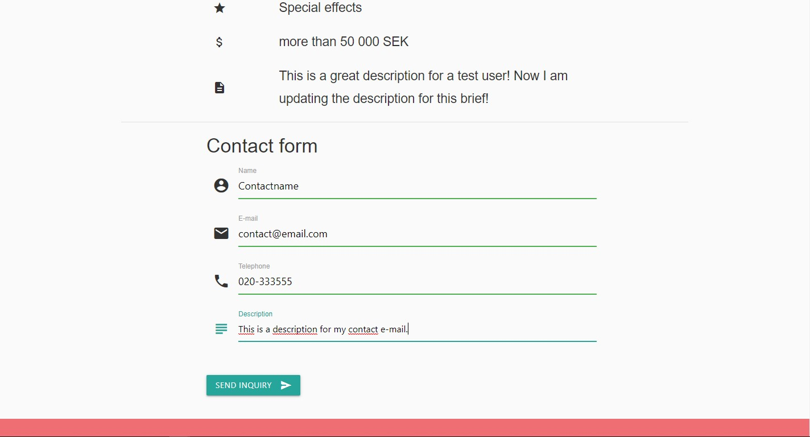

#### Story 7
As a user, I want to get information (social links, contact info etc.) about the owner of the site, so that I can contact the owner if I want to.
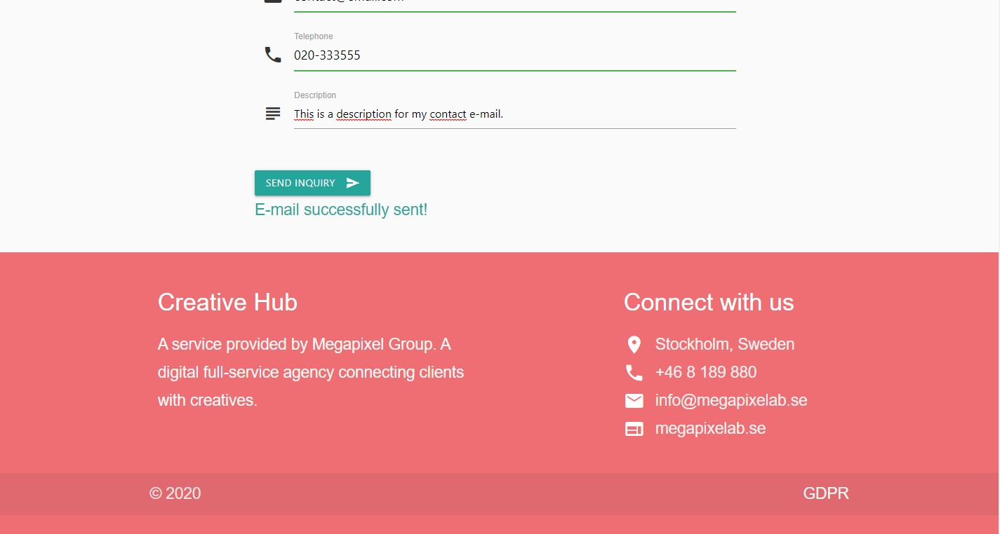

### Strategy
The goal with the application is to provide employers and creative a way to connect.
The design should fit the purpose and coming from the [materialize](https://materializecss.com/) framework.
The foundation of the application should be solid with room for improvement for future updates/releases.

### Scope
The users should be able to use a fully functioning application for performing CRUD operations and sending an e-mail form.
At this stage the user will experience a running application with the possibility to perform CRUD operations
and let others know you are interested in connecting.

Future releases may introduce:
 A wider range of functionalities and ways to interact
 The possibility to rate users
 Provide more valuable information and resources

### Structure
The application has a natural structure with the "home-section" giving a message, in this case welcoming the user to the application and describes how to use it. 
It's easy to navigate to the different sections of the page and perform desired CRUD operations.

### Skeleton
In this [link](https://github.com/robinwesterback/creative-hub/tree/master/wireframes) you can find the wireframes for each section that serves as the skeleton for the project.

### Surface
In this [link](https://materializecss.com/) you can find Materialize. 
This application is built using materialize css, components and js.

## Features
The application contains several features with a few left to be implemented.

### Existing Features

#### Navbar
A materialize [component](https://materializecss.com/navbar.html "Materialize Navbar") with a hamburger menu for mobile.

#### Footer
A materialize [component](https://materializecss.com/footer.html "Materialize Footer").

#### Icons
A materialize [component](https://materializecss.com/icons.html "Materialize Icons").

#### Forms
##### Text Inputs
Materialize [form input](https://materializecss.com/text-inputs.html "Materialize Text Inputs").

##### Select
Materialize [form select](https://materializecss.com/select.html "Materialize Select").

##### Date picker
Materialize [form date picker](https://materializecss.com/pickers.html "Materialize Pickers").

#### User login
The application allows the user to log in and out of a session.

#### CRUD Operations
The application operates to a MongoDB with 4 collections - users, briefs, creatives and skills.

##### Create document
The application allows the user to create a document in the MongoDB.

##### Read document
The application allows the user to read a document in the MongoDB.

##### Update document
The application allows the user to update a document in the MongoDB.

##### Delete document
The application allows the user to delete a document in the MongoDB.

#### Send email
I use [emailjs](https://www.emailjs.com/ "EmailJS") to let the user send emails to the site owner. 
The user gets notified wether it is a success or of it fails.

### Features Left to Implement

#### Smarter interactivity for users
Make functions, collections and the exchange of information between users better. 
E.g. search functions for skills, categorized in a more user friendly way as the application grows larger.

#### Recourses, functions and content
Provide more information, resources and possibilities to create better ads to improve success rate for user interaction.

#### Add images, links etc.
Give users the ability to add images, documents, links etc.

#### Defensive design
Make the application more compatible with browsers other than Chrome. Customize the 404 error webpage.
More secure way to log in.

#### Livechat and chat function
I might add a livechat for contacting the site owner and a chat function for communication between users.

#### Your thoughts
Are there any features that you would like me to implement to improve the application? Please get in touch and share your thoughts.

## Technologies Used
I used HTML, CSS, Javascript, Python, Flask and MongoDB to build this project.

### HTML
This project uses semantic [HTML](https://html.com/ "HTML") to improve SEO and user friendliness. 
The HTML is rendered from the templates directory. 

### CSS
The project uses responsive design to improve the user experience and availability on all devices. 
The [CSS](https://www.w3.org/Style/CSS/Overview.en.html "CSS") is separated using comments. 
It is rendered from the static directory.

### JS
I used [JavaScript](https://www.javascript.com/ "JavaScript") for some of the functions and interactivity on the application. 
Comments are provided to give an explanation of the functions. 
It is rendered from the static directory.

### Python
I used [Python](https://www.python.org/ "Python") for some of the functions and interactivity on the application. 
Comments are provided to give an explanation of the functions. 

### Flask
I used [Flask](https://flask.palletsprojects.com/en/1.1.x/ "Flask") to create the web application.
Here is a [cheatsheet](https://s3.us-east-2.amazonaws.com/prettyprinted/flask_cheatsheet.pdf/ "Flask Cheatcheet").  

### MongoDB
I used [MongoDB](https://www.mongodb.com/ "MongoDB") for the database and [PyMongo](https://pypi.org/project/pymongo/ "PyMongo") to interact with it.

## Testing
I have tested the application and looked for flaws in the design and errors in the functionality on several browsers on desktop, laptop and iPhone 7.
I have also tested the user stories to see if the application fills its purpose towards the user. 
The expected outcome is that the application is responsive and functional on all browsers/devices. 
Functions like links, CRUD operations and contact forms should work properly e.g "target=”_blank"" where appropriate. Below are my findings and comments.

### Functionality

| Description   | Expected outcome | Pass | Comments |
| ------------- |:----------------:| ----:| --------:|
| Input 50 letters in campaign_name | Max input of 30 letters | Yes | - |
| Post a form without filling in required fields | Shouldn't work, both backend and frontend validation | Yes | - |
| Log in with an e-mail that is not registered | Shouldn't work, error message should show | Yes | - |
| Send an empty contact form | Shouldn't work, fields are required | Yes | - |

### User Stories

| Description   | Expected outcome | Pass | Comments |
| ------------- |:----------------:| ----:| --------:|
| Click on a navigation link | Get navigated towards the desired link location | Yes | - |
| Create user account | User account created | Yes | - |
| Create a user account with a registered e-mail | It doesn't work and an error-message pops up | Yes | - |
| Delete a creative ad | Creative ad deleted | Yes | - |
| Edit and update brief | Brief edited and updated | Yes | - |
| Send a message from the contact form | Message gets sent | Yes | - |

### Different Browsers and devices

#### Desktop

| Description   | Expected outcome | Pass | Comments |
| ------------- |:----------------:| ----:| --------:|
| Internet Explorer | The application works appropriately | No | Paddings and margins doesn't work accordingly which ruins the design |
| Google Chrome | The application works appropriately | Yes | - |
| Mozilla Firefox | The application works appropriately | Yes | - |
| Safari | The application works appropriately | Yes | - |

#### Mobile

| Description   | Expected outcome | Pass | Comments |
| ------------- |:----------------:| ----:| --------:|
| Google Chrome | The application works appropriately | Yes | - |
| Safari | The application works appropriately | Yes | - |

### Responsiveness

I have tested the responsiveness of the application [here](http://ami.responsivedesign.is/# "Am I Responsive?") and it is responsive.

### Code validation

#### CSS
I validated my CSS with the [Jigsaw W3C Validation Service](https://jigsaw.w3.org/css-validator/ "CSS Validation"). 
I got 8 errors regarding that the property `padding-inline-start`, `margin-block-end` and `margin-block-start` doesn't exist.
I found this [information](https://developer.mozilla.org/en-US/docs/Web/CSS/padding-inline-start "Padding inline start on Mozilla") regarding the issue. 
The CSS does make a positive difference in the design of the application as I have tested this. 
Therefore I choose to keep it even though jigsaw regards the CSS as an error.

#### HTML
I validated my HTML with the [W3C Markup Validation Service](https://validator.w3.org/ "HTML Validator") with no errors or warnings to show.

#### JS
I ran my JavaScript through a linter, [ESLint](https://eslint.org/ "JavaScript Linter"), with no major issues. 
You can run ESLint on any file or directory like this: `$ npx eslint yourfile.js`.
Errors found was e.g 'title' is missing in props validation which isn't required for the application to function correctly.
You can find more information about the typechecking with proptypes [here](https://reactjs.org/docs/typechecking-with-proptypes.html?fbclid=IwAR0AgCEmLxhljebWPsYkhHBDVy1kwrKnd1g-jO7qma4Q1GttPOnfdfAa2bo "Typechecking with PropTypes")

### Defensive design
I've implemented defensive designs throughout the application. Fields are required before submitting. 
`maxLength` is applied to `input` fields. Error messages pops up where appropriate. 
Email confirmation message pops up after successfully sent email. 
There are more defensive design you can add to improve the user experience,
such as confirmation before deleting a creative ad/brief or adding interactive questionmarks that provide relevant information.

### Conclusion
After testing the deployed application my overall conclusion is that the application is working as intended. 
It has a lot of potential to provide even more value for the user with future installations of the application.
The minor flaws that exist don’t ruin the user experience but should be corrected in the future.

## Deployment
I followed this [guide](https://github.com/gitname/react-gh-pages "Deploy React to GitHub Pages") to create and deploy the react app to GitHub Pages.
Initially I created the app using git bash and VS Code locally on my computer and pushed the project to GitHub. 
From there I continued the development on GitPod, commited to git and pushed to the Master Branch on GitHub. 

To deploy this page to GitHub Pages from its [GitHub repository](https://github.com/robinwesterback/deploy-react-app "GitHub repository"), the following steps were taken:

1. Log into GitHub

2. From the list of repositories on the screen, select **robinwesterback/deploy-react-app**

3. Go to **Settings**

4. Scroll down to the **GitHub Pages** section.

5. Under **Source** click the drop-down menu labelled None and select **Branch: gh-pages**

6. On selecting **Branch: gh-pages** the page is automatically refreshed, the application is now deployed.

7. Scroll back down to the **GitHub Pages** section to retrieve the link to the deployed application.

Now you can package and push the project to **Branch: gh-pages** to update the deployed version of the application with the command `$ npm run deploy`.
At the moment of submitting this Milestone project the Development Branch and Master Branch are identical.

### How to run this project locally

1. Use this [link](https://github.com/robinwesterback/deploy-react-app/ "Deploy React App Repository") to get to the projects repository.

2. Click "Clone or Download".

3. Click the "copy" icon.

4. Open Git Bash in your local IDE.

5. Change your current working directory to where you want the cloned directory to be made.

6. Type `$ git clone` and then paste the URL you copied earlier.

   `git clone https://github.com/USERNAME/REPOSITORY`

7. When you press enter your local clone will be ready.

## Credits

### Content
All content on the application was written by me. 
The design was inspired by [Megapixel Groups](https://www.megapixelab.se/ "Megapixel Group") brand and graphic guidelines.

### Media
The logo used for this project was delivered by [Megapixel Group](https://www.megapixel.group/ "Megapixel Group").
The Favicon was generated [here](https://realfavicongenerator.net/ "Favicon").

### Acknowledgements
I'm happy that I got inspired to create the ROI calculator by Christian, CEO of [Megapixel Group](https://www.megapixel.group/ "Megapixel Group").
Alex the Man inspired me to create the app using [React](https://reactjs.org/ "React") as a framework.
I believe [React](https://reactjs.org/ "React") has proved to be a very good framework for creating this application and for long-term effiency.
It works better and is easier to work with than I could have imagined.
I'm looking forward to keep improving my knowledge of JavaScript and React to improve this application as well as applying it to future projects.

## Resources
Below is a list of the resources used to create this project:

- [Deploying a React App to GitHub Pages](https://github.com/gitname/react-gh-pages "Create React App and deploy to GitHub Pages")
- [React](https://reactjs.org/ "React")
- [React Tutorial](https://reactjs.org/tutorial/tutorial.html#before-we-start-the-tutorial "React Tutorial")
- [React Fundamentals](https://reactnative.dev/docs/intro-react "React Fundamentals")
- [React Custom Hooks](https://reactjs.org/docs/hooks-custom.html "React Custom Hooks")
- [Using the State Hook](https://reactjs.org/docs/hooks-state.html "Using the State Hook")
- [Hooks API Reference](https://reactjs.org/docs/hooks-reference.html "Hooks API Reference")
- [React Media Queries](https://github.com/ReactTraining/react-media "React Media Queries")
- [React FontAwesome](https://github.com/FortAwesome/react-fontawesome "React FontAwesome")
- [EmailJS and React](https://www.emailjs.com/docs/examples/reactjs/ "EmailJS and React")